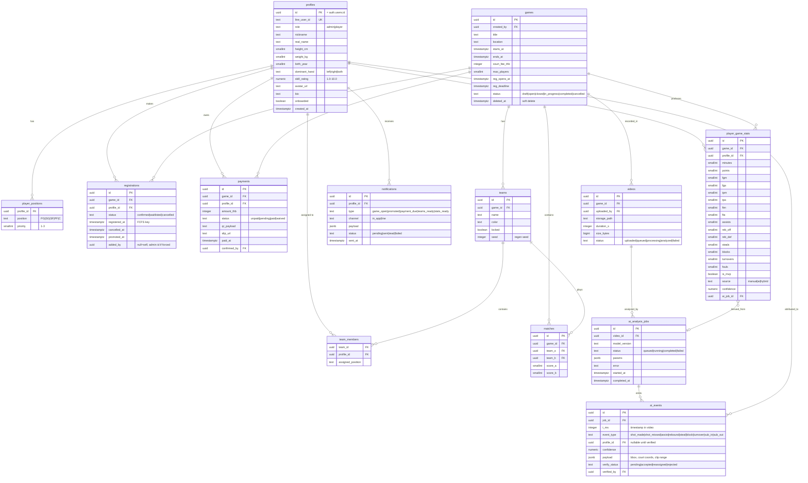

# Basket Bos — Database Design

**Version:** 1.0 (Milestone 0) · PostgreSQL (Supabase) · All tables have RLS enabled.

---

## 1. ER Diagram



## 2. Key Constraints & Indexes

```sql
-- One registration per player per game
ALTER TABLE registrations ADD CONSTRAINT uq_reg UNIQUE (game_id, profile_id);

-- FCFS / waitlist ordering
CREATE INDEX idx_reg_order ON registrations (game_id, status, registered_at);

-- One stat line per player per game
ALTER TABLE player_game_stats ADD CONSTRAINT uq_stats UNIQUE (game_id, profile_id);

-- One payment per player per game
ALTER TABLE payments ADD CONSTRAINT uq_pay UNIQUE (game_id, profile_id);

-- Positions: max 3 per player
-- enforced by trigger + UNIQUE (profile_id, position), UNIQUE (profile_id, priority)
```

Derived values (FG%, PPG, waitlist position, attendance rate, win rate, overall rating) are **never stored** — computed in views:

- `v_waitlist` — waitlist position via `row_number() over (partition by game_id order by registered_at)`
- `v_player_season_stats` — aggregates per player (totals, averages, percentages)
- `v_player_rating` — NBA-2K-style overall + rank tier
- `v_game_payment_summary` — paid/pending/unpaid counts & sums

## 3. Concurrency-Safe Registration (core of the product)

```sql
CREATE OR REPLACE FUNCTION register_player(p_game_id uuid)
RETURNS registrations
LANGUAGE plpgsql SECURITY DEFINER AS $$
DECLARE g games; confirmed int; r registrations;
BEGIN
  SELECT * INTO g FROM games WHERE id = p_game_id FOR UPDATE;  -- serialize per game
  IF g.status <> 'open' OR now() > g.reg_deadline THEN
    RAISE EXCEPTION 'REG_CLOSED';
  END IF;
  SELECT count(*) INTO confirmed FROM registrations
    WHERE game_id = p_game_id AND status = 'confirmed';
  INSERT INTO registrations (game_id, profile_id, status, registered_at)
  VALUES (p_game_id, auth.uid(),
          CASE WHEN confirmed < g.max_players THEN 'confirmed' ELSE 'waitlisted' END,
          clock_timestamp())
  RETURNING * INTO r;
  RETURN r;
END $$;
```

`cancel_registration()` mirrors this: locks the game row, marks cancelled, promotes the earliest `waitlisted` row to `confirmed` (sets `promoted_at`), and inserts a `notifications` row — all in one transaction. Two players tapping simultaneously can never both take the last slot.

## 4. Row-Level Security (summary)

| Table | select | insert | update |
|---|---|---|---|
| profiles | all members | self (via auth) | self; role changes admin-only |
| games | all | admin | admin |
| registrations | all | via `register_player()` only | via functions only |
| teams / team_members / matches | all | admin | admin |
| payments | own + admin sees all | system (on confirm list) | player → `pending` (own); admin → `paid/waived` |
| player_game_stats | all | admin / stat-keeper | admin |
| videos | all | admin | admin |
| ai_analysis_jobs / ai_events | admin (+worker via service token) | worker | worker + admin verify |
| notifications | own | system | own (mark read) |

## 5. Multi-Group Readiness

Phase 1 runs single-group. A `groups` table + `group_id` FK on `games` (and membership table `group_members(group_id, profile_id, role)`) is included in migration 001 but UI-hidden, so going multi-tenant later is additive, not a rewrite.

## 6. Storage Buckets

| Bucket | Access | Content |
|---|---|---|
| `avatars` | public read, owner write | profile images |
| `slips` | admin + owner | payment slips |
| `videos` | authenticated read, admin write | game videos (signed URLs for AI worker) |
